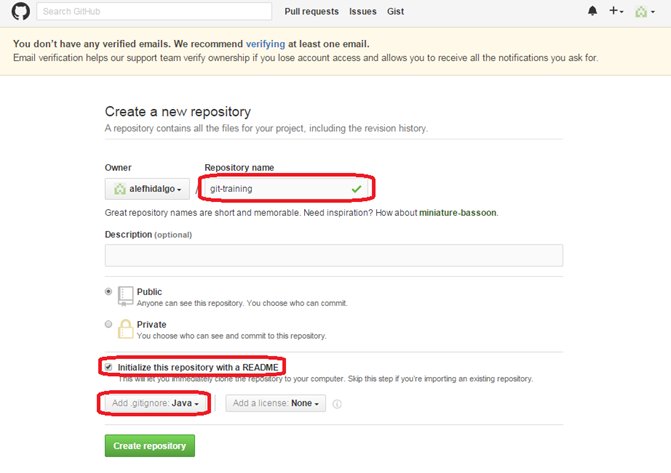
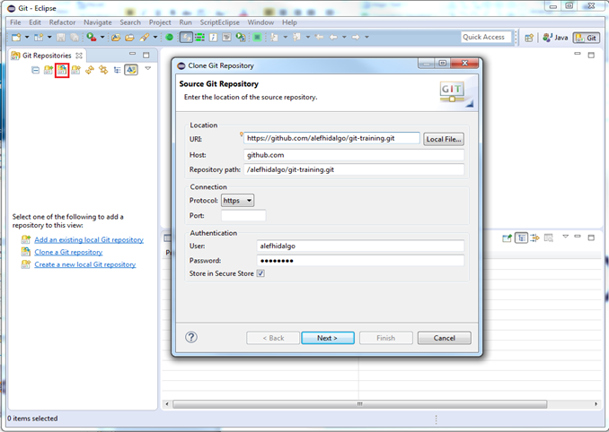

## Getting started

1. [ Eclipse ](#eclipse)
2. [ Command line ](#commandline)

### A) Using Eclipse
 1. Login/register on https://github.com/
 2. Create a repository   
 
 3. Copy clone URL   
 
 4. Open Eclipse, select a workspace and open Git perspective
 5. Ctrl + V   
 
 6. Import project   
 
 7. Open repository history   
 

### B) Using command line
 **Note**: steps 1-3 are the same as for option (A)  
 1. Login/register on https://github.com/ 
 2. Create a repository
 3. Copy clone URL
 4. Install Git for Windows, eg. using https://gitforwindows.org/
 5. Open a Git Bash window
 6. Configuring Git at the first time:  
 <pre>
    <b>$ git config --list  </b>
    <b>$ git config --global user.name '[user name]'   </b>
        Eg.: git config --global user.name 'VRBS'   
    <b>$ git config --global user.email '[user email]'  </b>
        Eg.: git config --global user.email 'victor.barres@gft.com'    
 </pre> 

 7. Cloning repository

    Base folder: c:\projects\git  
    Project folder: git-training  
    <pre>
    <b>$ cd /c  </b>
    <b>$ mkdir projects  </b>
    <b>$ cd projects  </b>
    <b>$ mkdir git  </b>
    <b>$ cd git  </b>
    <b>$ git clone <URL obtained from step 3>  </b>
        Eg.  $ git clone https://github.com/victorbarresf/git-training.git  
</pre>
Note: in case of obtaining 'SSL certificate problems' error when doing the clone, you can use sslVerify global conf. parameter to false, as follows:

<pre>
    <b>$ git -c http.sslVerify=false clone <URL>  </b>
</pre>
or  

<pre> 
    <b>$ git config --global http.sslVerify false</b>
    <b>$ git clone <URL></b>
</pre>

## License
Copyright (C) 2017 GFT. All rights reserved.

## Author Information
* Agile & Devops Practice Iberia. GFTIberia.PSU_Technology@gft.com
